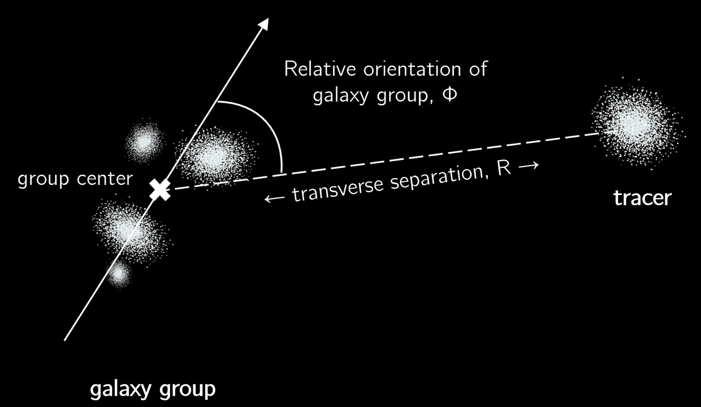

# spec-IA
This repository contains tools for measuring intrinsic alignments of galaxies and galaxy groups in spectroscopic data.

## Installation

spec-IA requires Python and the following libraries:

- NumPy
- Matplotlib
- Pandas
- SciPy
- Astropy
- Corrfunc (optional, for correlation functions)

These can be installed through pip:

bash
```pip install numpy matplotlib pandas scipy astropy```

or conda: 

bash
```conda install numpy matplotlib pandas scipy astropy```

The repository can be cloned via 

bash
```git clone https://github.com/cmlamman/spec-IA```


## Multiplet Alignment (a.k.a "Group Alignment")

[gal_groups.py](https://github.com/cmlamman/spec-IA/blob/main/alignment_functions/gal_groups.py) contains functions for identifying and measuring the alignment of galaxy groups. The alignment estimator is defined as the projected orienation of groups relative to a tracer sample, $\cos(2\Theta)$, as a function of projected separation $R$. A high-level example of this can be found in [basic_group_alignment.ipynb](https://github.com/cmlamman/spec-IA/blob/main/basic_group_alignment.ipynb).

The minimum to run these basic functions is a catalog with the columns RA, DEC (in degrees) and Z (redshift).


